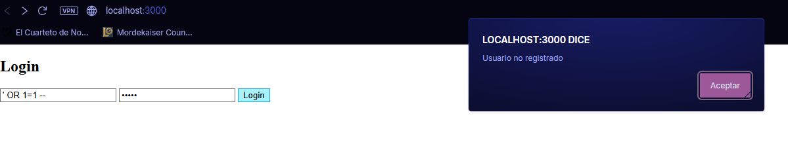

## Protección contra SQL Injection

Como medida de seguridad para prevenir ataques de **SQL Injection**, se
implementó el uso de consultas parametrizadas. Esto evita que los datos
ingresados por el usuario sean interpretados como parte del código SQL.

Ejemplo implementado:

``` js
const user = await db.get(
    "SELECT * FROM users WHERE email = ?",
    [email]
);
```

En este caso, el valor de `email` se envía como un parámetro separado de
la consulta, por lo que la base de datos lo trata únicamente como un
dato y no como código ejecutable. De esta manera, se previene la
inyección de instrucciones maliciosas dentro de la consulta SQL.

------------------------------------------------------------------------

## Ejemplo de intento de SQL Injection

A continuación se muestra un ejemplo de cómo se vería un intento de
ataque por SQL Injection:



------------------------------------------------------------------------

## Usuarios de prueba

Para facilitar las pruebas del sistema, se crearon automáticamente los
siguientes usuarios en la base de datos:

-   **test1@test.com**\
    Contraseña: `123456`

-   **test2@test.com**\
    Contraseña: `123456`

-   **admin@test.com**\
    Contraseña: `admin123`
